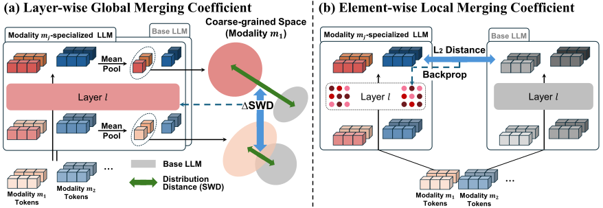

# ES-Merging: Biological MLLM Merging via Embedding Space Signals ([NeurIPS 2026](https://neurips.cc/Downloads/2026))

- **Authors:** [Wonbin Lee](https://scholar.google.com/citations?user=YcdmuwkAAAAJ&hl=ko)\*, [Dongki Kim](https://dongkikim95.github.io/)\*, and [Sung Ju Hwang](http://www.sungjuhwang.com/)
- **Paper:** [arXiv](https://arxiv.org/abs/2603.14405) | [PDF](https://arxiv.org/pdf/2603.14405)



ES-Merging combines LLM-based experts that share a common backbone. Experts can specialize in different tasks, domains, or modalities. See the [paper](https://arxiv.org/abs/2603.14405) for method details.

This repository includes a reusable LoRA merging module and biological interaction examples. Datasets, checkpoints, and generated coefficients must be prepared locally.

## Contents

- [Repository Structure](#repository-structure)
- [Setup](#setup)
- [Merging Models](#merging-models)
- [Biological Example](#biological-example)
- [Tests](#tests)
- [Citation](#citation)

## Repository Structure

```text
es-merging/
├── src/
│   ├── es_merging.py                     # Coefficient loading and LoRA merging
│   ├── es_merging_inference.py           # Biological inference example
│   ├── Coefficient_Setting/
│   │   ├── embedding_construction.py     # Collect hidden states
│   │   ├── compute_layer_coef.py         # Estimate layer-wise coefficients
│   │   └── compute_element_coef.py       # Estimate element-wise coefficients
│   ├── examples/
│   │   └── prepare_bindingdb.py           # Prepare the BindingDB example
│   └── tests/
│       └── test_prepare_bindingdb.py      # Preprocessing and inference-input tests
├── assets/
│   └── es_merging_overview.svg            # Method overview
├── requirements.txt
├── LICENSE
├── .gitignore
└── README.md
```

## Setup

### Installation

Run all commands from the repository root. Create a Python 3.10 environment and install the dependencies:

```bash
python3.10 -m venv .venv
source .venv/bin/activate
python -m pip install -r requirements.txt
```

The merging module requires PyTorch and pandas. `requirements.txt` also includes dependencies for the biological examples. Install your expert model implementations and their additional dependencies separately.

Choose a PyTorch build that matches your CUDA environment. Full checkpoint-based inference has not been validated in a fresh installation.

### Train Expert Models

Train or fine-tune your experts and save their checkpoints. Use a shared LLM backbone and compatible LoRA configurations. Follow each model's own training pipeline.

### Prepare Probe Data

Randomly select **330 representative samples per expert modality** for coefficient estimation. Store them under `./coefficient_data/`. Match the data formats, preprocessing, and data loaders to your models.

## Merging Models

### Python API

The merging API accepts three compatible expert state dictionaries. From the repository root, import it into your inference pipeline:

```python
from src.es_merging import merge_lora_state_dicts

# expert_1, expert_2, and expert_3 are already loaded LLM-based experts.
# Coefficient files must correspond to these experts in the same order.
merged_state = merge_lora_state_dicts(
    expert_1.state_dict(),
    expert_2.state_dict(),
    expert_3.state_dict(),
    method="es",
    layer_coef_path="./coefficients/layerwise_coefficients.csv",
    element_coef_path="./coefficients/elementwise_coefficients.pt",
    device="cpu",
)
expert_1.load_state_dict(merged_state, strict=True)
# Use expert_1 as the merged LLM in your inference pipeline.
```

| Method | Required coefficients |
| --- | --- |
| `es` | Layer-wise CSV and element-wise `.pt` |
| `layerwise` | Layer-wise CSV |
| `elementwise` | Element-wise `.pt` |

### Adapting to Other Domains

The supplied setup and inference examples target biological interaction tasks. For another domain, prepare your datasets and adapt the inference code to your task. Update data loading, prompts, prediction parsing, and evaluation.

If you change experts or modalities, also adapt model loading, modality preprocessing, and coefficient-estimation inputs.

## Biological Example

### Models and Data

#### Expert Models

This example uses [Mol-LLaMA](https://arxiv.org/abs/2502.13449) for molecules, [Prot2Text-V2](https://arxiv.org/abs/2505.11194) for proteins, and [Cell-o1](https://arxiv.org/abs/2506.02911) for cells. All three share Llama-3.1-8B. Pass their checkpoint paths through the scripts' model-path arguments.

#### Probe Data

Store probe data in `./coefficient_data/` using these files:

- `protein.txt`: protein sequences.
- `drug.txt`: molecule SMILES strings.
- `cell_line.txt`: comma-separated gene lists.
- `drug_3d.json`: molecule structures keyed by SMILES, with `atoms` and `coordinates`.

Use one sample per line in the text files. Keep their row order aligned.

#### ICL Training Data (Optional)

For in-context learning (ICL), include molecule atom types and 3D coordinates in the training examples. Save them as `./data/<dataset_name>/train_3d.json` and pass the path through `--train_json_path`. Omit this argument to disable ICL.

### Coefficient Estimation

#### 1. Collect Hidden States

```bash
python src/Coefficient_Setting/embedding_construction.py \
  --data_dir ./coefficient_data \
  --output_path ./Embedding \
  --batch_size 2
```

Output:

```text
./Embedding/embedding.pkl
```

#### 2. Compute Layer-Wise Coefficients

Set the placeholders to your experiment settings:

```bash
LAYER_TEMPERATURE="<temperature>"
SWD_NUM_PROJECTIONS="<num_projections>"
SWD_P="<swd_p>"

python src/Coefficient_Setting/compute_layer_coef.py \
  --pkl_path ./Embedding/embedding.pkl \
  --output_base ./coefficients/Layer_Wise \
  --alpha 1.0 \
  --temperature "$LAYER_TEMPERATURE" \
  --swd_num_projections "$SWD_NUM_PROJECTIONS" \
  --swd_p "$SWD_P"
```

Output:

```text
./coefficients/Layer_Wise/SWD_anchor_1.0/<num_projections>_<swd_p>_<temperature>/layerwise_merging_coefficients.csv
```

Use this CSV as `LAYER_COEF_PATH` during inference.

#### 3. Compute Element-Wise Coefficients

Set `<tau>` for your experiment:

```bash
ELEMENT_TAU="<tau>"

python src/Coefficient_Setting/compute_element_coef.py \
  --data_dir ./coefficient_data \
  --output_dir ./coefficients/Element_Wise \
  --layers 0-31 \
  --batch_size 2 \
  --score_type grad_abs \
  --tau "$ELEMENT_TAU"
```

Output:

```text
./coefficients/Element_Wise/mse/grad_abs/element_wise_coef.pt
```

This step reads probe data and checkpoints directly. It does not use `embedding.pkl`.

### Inference and Evaluation

The inference script merges expert weights in memory, then evaluates the merged model.

#### Prepare the BindingDB Dataset

The data comes from [BindingDB](https://www.bindingdb.org/rwd/bind/chemsearch/marvin/Download.jsp). This example uses the `BindingDB/protein` split from [PSICHIC](https://github.com/huankoh/PSICHIC/blob/main/dataset/README.md) ([download](https://drive.google.com/drive/folders/1ZRpnwXtllCP89hjhfDuPivBlarBIXnmu)).

Download and preprocess the train/test splits:

```bash
python src/examples/prepare_bindingdb.py \
  --download \
  --input_dir ./data/BindingDB_protein/raw \
  --output_dir ./data/BindingDB_protein \
  --workers 4
```

RDKit generates molecule 3D coordinates and ICL fingerprints. Proteins remain amino-acid sequences.

Files are saved under `./data/BindingDB_protein/`:

- `train.csv`, `test.csv`: tables in the inference format.
- `train_3d.json`: ICL training records with molecule structures and fingerprints.
- `test_3d.json`: molecule structures for evaluation.

Failed rows are excluded and logged in `failed_rows.csv`. Checksums, settings, and row counts are saved in `preprocessing_report.json`.

For a small trial, add `--max_rows 100` and use `--output_dir ./data/BindingDB_protein_sample`. Point the inference paths to that directory.

To use existing CSV files, omit `--download`. Place `train.csv` and `test.csv` in `--input_dir`. They must contain `Ligand`, `Protein`, and binary `classification_label` columns.

For other datasets, adapt preprocessing to their modalities and your models' input formats.

#### Run BindingDB Inference

Set `LAYER_COEF_PATH` to the CSV from [Compute Layer-Wise Coefficients](#2-compute-layer-wise-coefficients):

```bash
LAYER_COEF_PATH="<path_to_layerwise_merging_coefficients.csv>"

python src/es_merging_inference.py \
  --dataset_name BindingDB_protein \
  --test_data_path ./data/BindingDB_protein/test.csv \
  --molecule_3d_path ./data/BindingDB_protein/test_3d.json \
  --train_json_path ./data/BindingDB_protein/train_3d.json \
  --merging_method es \
  --layer_coef_path "$LAYER_COEF_PATH" \
  --element_coef_path ./coefficients/Element_Wise/mse/grad_abs/element_wise_coef.pt \
  --base_model_path ./checkpoints/Llama-3.1-8B-Instruct \
  --molecule_model_path ./checkpoints/Mol-Llama-3.1-8B-Instruct \
  --esm_path ./checkpoints/esm2_t36_3B_UR50D \
  --prot2text_base_path ./checkpoints/Prot2Text-V2/model_checkpoint.pt \
  --prot2text_lora_path ./checkpoints/Prot2Text-V2/adapter_checkpoint \
  --cell_lora_path ./checkpoints/cell-o1/lora_checkpoint \
  --output_dir ./outputs/BindingDB_protein \
  --batch_size 2
```

For other supported biological datasets, update `--dataset_name` and the data and output paths.

#### Outputs and Metrics

- `results_<dataset>_<method>.csv`: generated responses, parsed predictions, and input fields.
- `metrics_<dataset>_<method>.json`: accuracy, total accuracy, macro-F1, and invalid-response rate.

## Tests

Run the CPU tests for BindingDB preprocessing and inference inputs:

```bash
python -m unittest discover -s src/tests -v
```

## Citation

If you use this code, please cite the paper:

```bibtex
@inproceedings{lee2026merging,
  title={ES-Merging: Biological MLLM Merging via Embedding Space Signals},
  author={Lee, Wonbin and Kim, Dongki and Hwang, Sung Ju},
  booktitle={Fortieth Annual Conference on Neural Information Processing Systems},
  year={2026},
  url={https://arxiv.org/abs/2603.14405}
}
```
